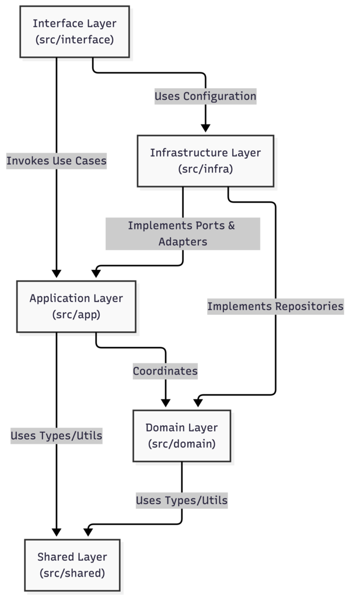
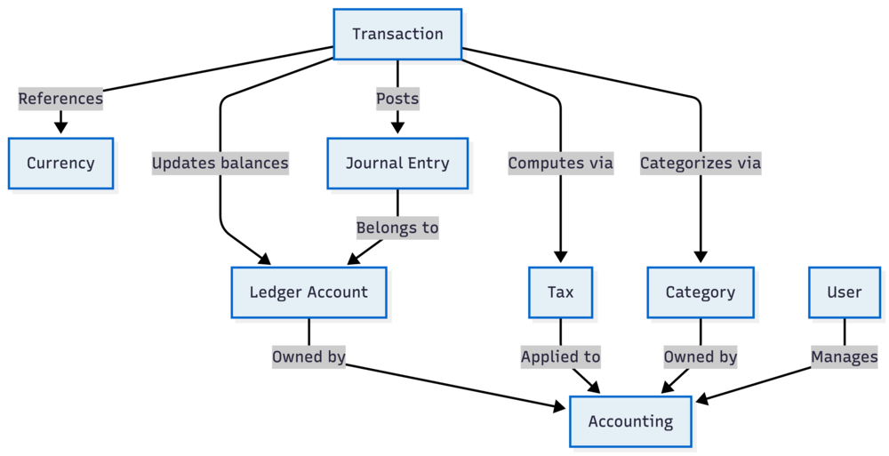

# 5. Building Block View

The building block view shows the static decomposition of the system into building blocks (modules, components, subsystems) as well as their dependencies. It explains the structure of the `ledgernova-core` application by zooming into its architectural layers and bounded contexts.

## 5.1 Level 1 (Whitebox: Overall System)

At the highest level, LedgerNova Core strictly adheres to a Domain-Driven Design (DDD) and Clean Architecture pattern. The system is divided into functional layers where outer layers depend on inner layers, with the `Domain` layer at the absolute center, isolated from all external concerns.

_Figure 1: View the mermaid sourcecode here:&#x20;_[_05.1-level-1-system.mermaid_](./assets/05.1-level-1-system.mermaid)

### Building Blocks - Level 1

| Name                                   | Responsibility                                                                                                                                                                                                                                    |
| -------------------------------------- | ------------------------------------------------------------------------------------------------------------------------------------------------------------------------------------------------------------------------------------------------- |
| **Interface Layer (`src/interface`)**  | The entry points to the application. It contains the HTTP REST controllers (generated via tsoa) and the Model Context Protocol (MCP) tool handlers for autonomous AI agents. It translates external requests into calls to the Application Layer. |
| **Application Layer (`src/app`)**      | Contains application-specific business rules and Use Cases. It orchestrates the flow of data to and from the Domain entities, and directs those entities to use their core business logic to achieve the goals of the Use Case.                   |
| **Domain Layer (`src/domain`)**        | The heart of the software. Contains pure enterprise-wide business rules, entities, policy logic (like the NTA tax formulas), and domain services. It has zero dependencies on any technical details like databases or frameworks.                 |
| **Infrastructure Layer (`src/infra`)** | Contains technical capabilities that support the layers above. This includes the database adapters (Drizzle ORM for PostgreSQL), external API integrations (Paystack, FIRS, Mono, ZeptoMail), caching (Redis), and observability configuration.   |
| **Shared Layer (`src/shared`)**        | Cross-cutting concerns, ubiquitous utility functions (e.g., string and date utilit), and shared domain types used across multiple boundaries.                                                                                                     |

---

## 5.2 Level 2 (Whitebox: Domain Layer)

Zooming into the `Domain Layer` (the center of our architecture), the system is further decomposed into several strictly bound "Modules" or boundaries. These modules enforce the rules of double-entry accounting and taxation.

_Figure 2: View the mermaid sourcecode here:&#x20;_[_05.2-level-2-domain.mermaid_](./assets/05.2-level-2-domain.mermaid)

### Building Blocks - Level 2 (Domain Modules)

| Name               | Responsibility                                                                                                                                                                                                                                                       |
| ------------------ | -------------------------------------------------------------------------------------------------------------------------------------------------------------------------------------------------------------------------------------------------------------------- |
| **Accounting**     | The core grouping mechanism representing the legal entity whose books are being managed (Individual, Sole Trader, or Organization). All financial data is strictly partitioned by the Accounting block.                                                              |
| **Transaction**    | The central aggregate that orchestrates the recording of a financial event. A Transaction is immutable once posted and is responsible for producing the corresponding `Journal Entry` records to balance the books, applying `Tax` rules, and converting `Currency`. |
| **Journal Entry**  | Represents a single line item (debit or credit) within a `Transaction`. It directly mutates the balance of a specific `Ledger Account`.                                                                                                                              |
| **Ledger Account** | The chart of accounts (e.g., Assets, Liabilities, Equity, Revenue, Expenses). Contains the running chronological ledger for a specific financial bucket owned by an `Accounting` entity.                                                                             |
| **Tax**            | Contains all Nigerian tax policies (PIT, VAT, WHT, CIT). Computes tax liabilities and deductions purely functionally based on input data from a `Transaction` or `Category` mapping.                                                                                 |
| **Category**       | The user-facing taxonomy for organizing income and expenses. Categories map directly to underlying `Tax` keys to automate tax computations for non-accountant users.                                                                                                 |
| **Currency**       | Manages system-supported currencies and cross-currency exchange rates, ensuring multi-currency transactions can compute a consolidated Networth.                                                                                                                     |
| **User**           | Represents the human operator or AI agent identity. A User role manages access and permissions to one or many `Accounting` entities but is decoupled from the financial records themselves.                                                                          |
