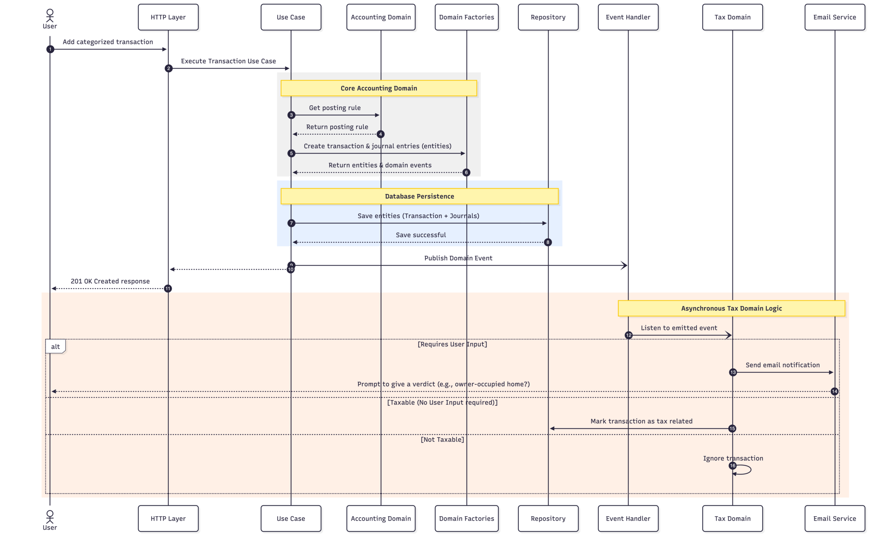

# 6. Runtime View

The runtime view describes the concrete behavior and interactions of the system’s building blocks in the form of scenarios. It explains how the components detailed in the Building Block View interact at runtime to fulfill the most critical use cases of LedgerNova Core.

## 6.1 Core Accounting and Tax Flow (End-to-End)

This scenario illustrates the complete lifecycle of a categorized transaction being recorded by a user, correctly balanced using double-entry posting rules, and asynchronously evaluated for tax compliance. This flow highlights the strict separation between the core accounting rules and the taxation domain, adhering to our Domain-Driven Design constraints.

### 6.1.1 Overview Diagram

_Figure 1: View the mermaid sourcecode here:&#x20;_[_06.1-core-accounting-flow.mermaid_](./assets/06.1-core-accounting-flow.mermaid)

### 6.1.2 Step-by-Step Description

| Step      | Component                                | Action                                                                                                                                                                                                                                             |
| --------- | ---------------------------------------- | -------------------------------------------------------------------------------------------------------------------------------------------------------------------------------------------------------------------------------------------------- |
| **1-2**   | **HTTP Layer & Use Case**                | The User adds a categorized transaction to a ledger account. The `HTTP Layer` routes the payload and calls the appropriate Application `Use Case`.                                                                                                 |
| **3-4**   | **Accounting Domain**                    | The `Use Case` delegates to the `Accounting Domain` to retrieve the correct double-entry posting rule based on the provided transaction details.                                                                                                   |
| **5-6**   | **Domain Factories**                     | Using the rules, the internal Domain Factories instantiate the new `Transaction` and corresponding balancing `Journal Entries` making up the core entities. These factories return the validated entities alongside any uncommitted Domain Events. |
| **7-8**   | **Repository**                           | The `Use Case` calls the database `Repository` and successfully saves the created entities.                                                                                                                                                        |
| **9-11**  | **Interface / Event Bus**                | The `Use Case` publishes the events, allowing them to be consumed by other autonomous boundaries, and then returns a fast `201 Created` response back to the User.                                                                                 |
| **12-13** | **Tax Domain**                           | An independent Event Handler listens to the emitted domain event and hands the transaction data over to the standalone `Tax Domain` engine for evaluation.                                                                                         |
| **14-15** | _(Alternative 1)_ **Requires More Info** | If the transaction implies complex conditional tax rules (e.g., the user sold an asset, but it must be verified if it was an owner-occupied home), a notification is dispatched via the `Email Service` prompting the User to provide a verdict.   |
| **16**    | _(Alternative 2)_ **Taxable**            | If the transaction is taxable and requires no further user input, the system updates the repository to mark the transaction as properly tax related.                                                                                               |
| **17**    | _(Alternative 3)_ **Ignored**            | If the transaction is fundamentally not taxable, the `Tax Engine` safely ignores it, avoiding any unnecessary state mutations or prompts.                                                                                                          |
