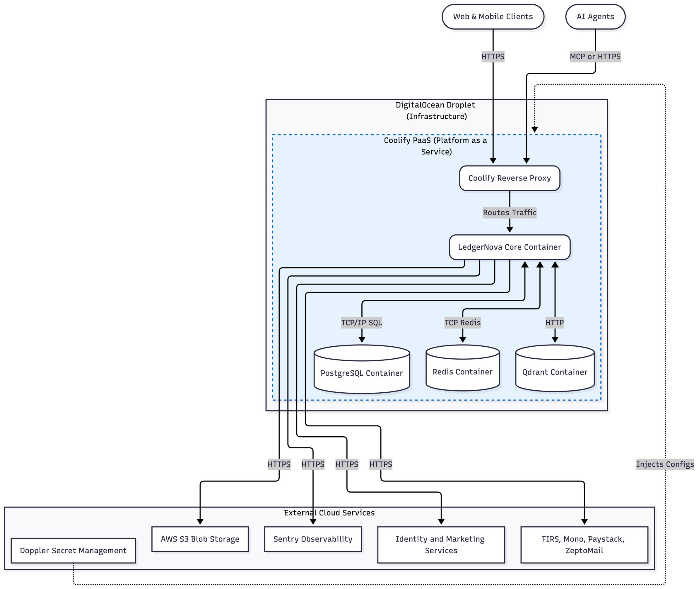

# 7. Deployment View

The Deployment View describes exactly where and how the LedgerNova Core software is deployed to run in the target environment. It explains the mapping from the codebase artifacts to the physical and virtual infrastructure nodes, as well as how configuration/secrets are injected into those nodes.

LedgerNova embraces a modern PaaS-driven containerized approach that prioritizes fast deployment speeds, simplified configuration via Doppler, and isolated dependencies using Coolify on DigitalOcean.

## 7.1 Infrastructure Architecture (Level 1)

At the highest level, the system relies on a single robust **DigitalOcean Droplet** serving as our Infrastructure as a Service (IaaS). Sitting atop this server is **Coolify**, an open-source Platform as a Service (PaaS) that manages our entire container lifecycle.

_Figure 1: View the mermaid sourcecode here: [07.1-deployment-infrastructure.mermaid](./assets/07.1-deployment-infrastructure.mermaid)_

### 7.1.1 DigitalOcean Droplet (IaaS)

- **Role**: The foundational physical/virtual compute node.
- **Purpose**: Provides the CPU, RAM, and internal SSD bounds for the entire system suite.
- **Operating System**: Linux (Ubuntu).
- **Network Security**: External incoming traffic is restricted solely to standard web ports (80/443), with Coolify handling SSL termination and internal routing.

### 7.1.2 Coolify (PaaS) & Internal Containers

All internal systems run as Docker containers strictly managed and orchestrated by Coolify.

| Container / Node    | Role / Technology    | Description                                                                                                                                                                      |
| ------------------- | -------------------- | -------------------------------------------------------------------------------------------------------------------------------------------------------------------------------- |
| **Reverse Proxy**   | Traefik / Caddy      | Handled natively by Coolify. Acts as the entry point, resolving domains, terminating SSL certificates (via Let's Encrypt), and forwarding requests to the Node.js API container. |
| **LedgerNova Core** | Node.js Runtime      | The monolith serving our API, Application, and Domain rules (compiled to JavaScript). Multiple instances/replicas can be spun up by Coolify based on load.                       |
| **PostgreSQL**      | Relational Database  | The primary transactional database where ledgers and journals are stored. Runs persistently on attached volumes ensuring ACID compliance.                                        |
| **Redis**           | In-Memory Data Store | Acts as a fast response cache and the backbone for the background job processing (BullMQ / Bull Board).                                                                          |
| **Qdrant**          | Vector Database      | Maintains semantic context and vector embeddings, particularly for enabling intelligent AI Agent integrations into the product.                                                  |

### 7.1.3 External Cloud Services

The Node.js API container relies entirely on these third-party systems via HTTPS interactions to fulfill external domains:

- **AWS S3**: Cloud blob storage used as an immutable vault for transaction attachments (e.g., PDFs, invoices).
- **Sentry**: Observability platform catching exceptions, runtime crashes, and tracing request performance.
- **Doppler**: Centralized configuration management (discussed comprehensively in Section 7.3).
- **Core Systems**: FIRS Tax ProMax (taxation), Mono (open banking), Paystack (billing), and ZeptoMail (transactional email).
- **Identity & Marketing**: Google Auth, Mailchimp, and MailerLite.

---

## 7.2 Deployment Mapping and Artifacts

The system is deployed as a consolidated **monolithic runtime architecture**. Even though our Domain Layer (see _5. Building Block View_) cleanly separates contexts such as "Tax", "Transactions", and "Accounting", these blocks are not distributed as separate microservices.

**Mapping software to infrastructure:**

- TypeScript code (found in `src/*`) maps directly to a **single Node.js Docker Container image** artifact.
- During a deployment, Coolify builds the Dockerfile, compiles the TypeScript, drops dev dependencies, and hot-swaps the container.
- **Database Schema Mapping**: The Drizzle ORM schema represents the artifact for database structure. As a pre-start (or hook) step during deployment, Drizzle database migration scripts are applied to the PostgreSQL container to ensure code and table definitions remain deeply synchronized.

---

## 7.3 Configuration and Secret Management

LedgerNova does not store raw `.env` files anywhere in version control or directly on servers. We utilize **Doppler** to distribute secrets dynamically, guaranteeing strong security and auditing of environment configurations across all environments ("development", "staging", "production").

**The Configuration Lifecycle:**

1.  **Storage (Doppler)**: API Keys, AWS keys, database passwords, and runtime flags are encrypted and updated purely on Doppler's platform.
2.  **Injection (Coolify Pipeline)**: When Coolify initiates a deployment of the LedgerNova Core, it utilizes the Doppler CLI (or Doppler Service Token) to securely pull and inject these keys into the Node.js Docker environment at startup.
3.  **Application Consumption (`vars.config.ts`)**: Within the codebase, configurations are not arbitrarily fetched. The file `src/infra/config/vars.config.ts` parses `process.env`. This acts as the secure internal schema for the application, ensuring that configurations are predictable and typed for all downstream code.
